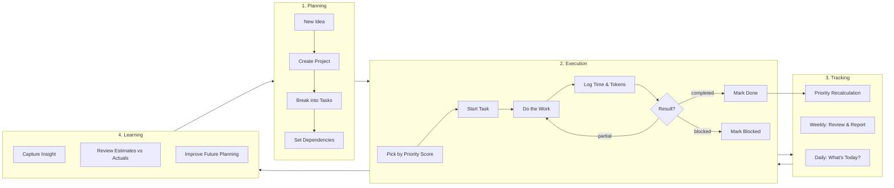
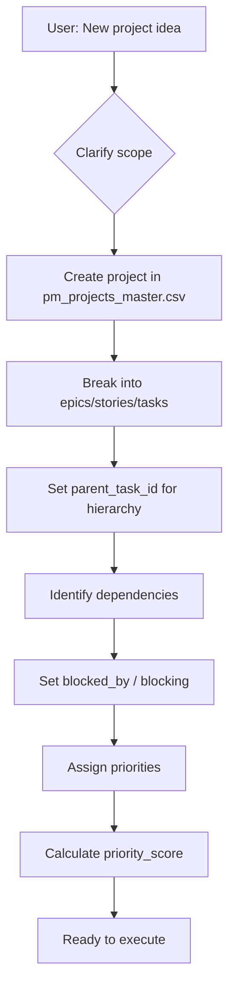
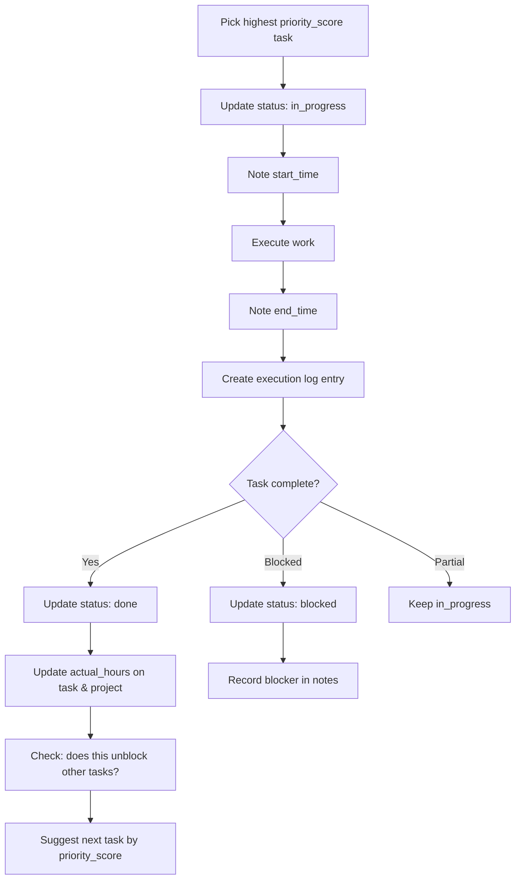
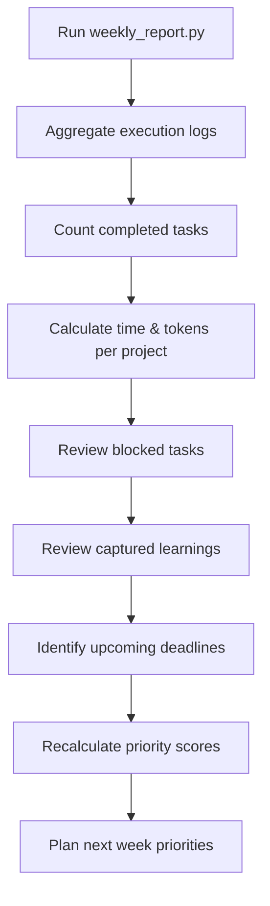
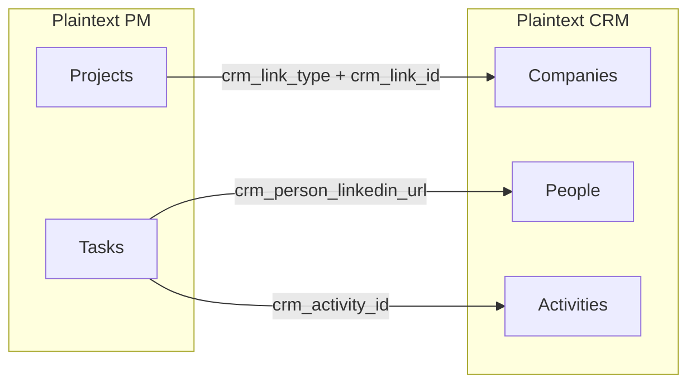

# PM System Flow Diagram

## Overview



---

## Detailed Flows

### Planning Phase



### Execution Phase



### Priority Calculation

```
priority_score (0.0 to 1.0) =
    0.30 * deadline_urgency     +    # max(0, 1 - days_until / 14)
    0.30 * manual_priority      +    # hot=1.0, medium=0.5, low=0.2
    0.20 * blocker_impact       +    # min(1, blocking_count * 0.2)
    0.20 * age_factor                # min(0.3, age_days * 0.01)
```

### Weekly Review Flow



---

## Data Flow Map

```
pm/
├── pm_projects_master.csv    ← Projects registry
│       ↕ project_id
├── pm_tasks_master.csv       ← Tasks with hierarchy & deps
│       ↕ task_id
├── pm_execution_log.csv      ← Time & token tracking
│
└── pm_learnings.csv          ← Captured insights
```

**Key relationships:**
- Tasks belong to Projects (via `project_id`)
- Tasks can nest (via `parent_task_id`)
- Tasks can depend on each other (via `blocked_by` / `blocking`)
- Execution logs link to Tasks and Projects
- Learnings optionally link to Tasks and Projects

---

## Optional: CRM Integration



When plaintext-crm is connected, PM tasks gain CRM context:
- See company info when working on client projects
- See person details when tasks involve specific contacts
- Daily briefing combines PM tasks and CRM follow-ups

See [integrations/plaintext-crm.md](../integrations/plaintext-crm.md) for setup.
